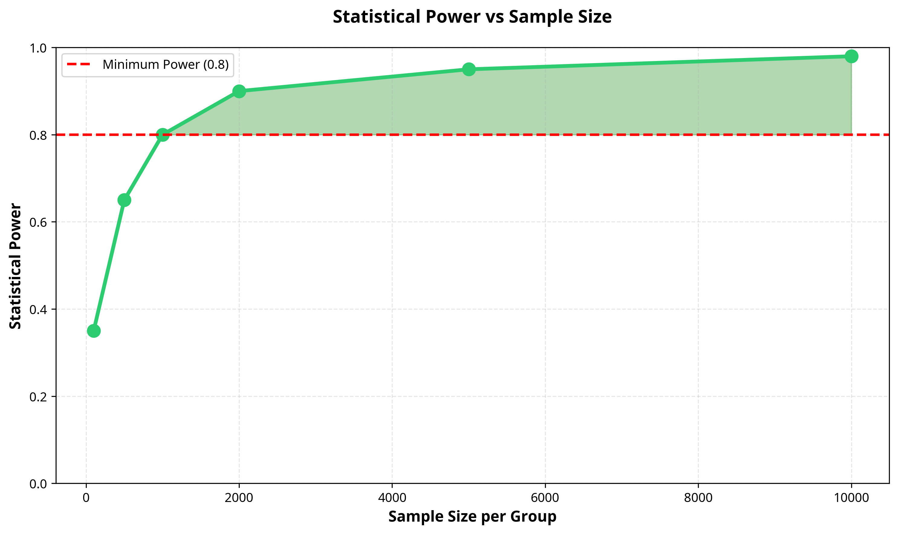

# A/B Testing Statistical Framework

   

---

## 🇧🇷 Framework Estatístico para Testes A/B

Framework para **A/B Testing** que combina abordagens **frequentista** e **bayesiana**. Inclui cálculo de tamanho de amostra, testes de hipótese (z-test de duas proporções), análise bayesiana com distribuições Beta e interpretação formatada dos resultados.

### Casos de Uso

- Validar mudanças de produto antes do lançamento
- Otimizar campanhas de marketing e landing pages
- Medir impacto de alterações em UX/UI
- Comparar taxas de conversão entre variantes

### 📊 Abordagens Estatísticas

#### Frequentista vs Bayesiana

| Aspecto | Frequentista | Bayesiana |
|---------|--------------|-----------|
| **Filosofia** | Probabilidade como frequência de longo prazo | Probabilidade como grau de crença |
| **Output** | P-valor e intervalo de confiança | Probabilidade de B > A |
| **Interpretação** | Rejeitar ou não H₀ | Probabilidade direta do resultado |
| **Stopping Rule** | Deve ser definido antes | Pode parar quando quiser |
| **Prior Knowledge** | Não utiliza | Incorpora conhecimento prévio |

### 📂 Estrutura do Repositório

```
ab-testing-statistical-framework-python/
├── src/
│   └── hypothesis_testing/
│       ├── __init__.py
│       └── ab_test.py             # Framework principal
├── tests/
│   └── test_ab_framework.py       # Testes unitários
├── images/                        # Visualizações geradas
├── setup.py                       # Configuração de instalação
├── requirements.txt
├── CONTRIBUTING.md
├── CHANGELOG.md
├── LICENSE
└── README.md
```

### � Visualizações

O framework gera visualizações para auxiliar na análise dos testes:




### �🚀 Instalação e Uso

```bash
# Clone o repositório
git clone https://github.com/galafis/ab-testing-statistical-framework-python.git

# Navegue até o diretório
cd ab-testing-statistical-framework-python

# Instale as dependências
pip install -r requirements.txt

# Execute o exemplo
python src/hypothesis_testing/ab_test.py
```

**Saída esperada:**
```
Sample Size Calculation:
------------------------------------------------------------
Required sample size per group: 3841

============================================================
A/B TEST RESULTS (FREQUENTIST)
============================================================
Conversion Rate A: 0.0800
Conversion Rate B: 0.0967
Absolute Difference: 0.0167
Relative Lift: 20.83%
Z-Statistic: 1.6084
P-Value: 0.1077
Significant: False
95% CI: (-0.0036, 0.0370)
============================================================

============================================================
A/B TEST RESULTS (BAYESIAN)
============================================================
Probability B > A: 94.38%
Probability A > B: 5.62%
Expected Loss (choosing B): 0.000248
Expected Loss (choosing A): 0.016875
============================================================
```

### 📝 Exemplos de Uso

#### 1. Cálculo de Tamanho de Amostra

Antes de iniciar um teste A/B, é crucial calcular quantos usuários você precisa:

```python
from src.hypothesis_testing.ab_test import ABTest

# Inicializar framework
ab_test = ABTest(alpha=0.05, power=0.80)

# Calcular tamanho de amostra necessário
sample_size = ab_test.calculate_sample_size(
    baseline_rate=0.10,      # Taxa de conversão atual: 10%
    mde=0.20,                # Efeito mínimo detectável: 20% de melhoria
    ratio=1.0                # Proporção 1:1 entre controle e tratamento
)

print(f"Você precisa de {sample_size} usuários por grupo")
# Output: Você precisa de 3841 usuários por grupo
```

#### 2. Teste Frequentista (Z-Test)

```python
# Dados do teste
conversions_a = 120    # Conversões no grupo A (controle)
visitors_a = 1500      # Visitantes no grupo A

conversions_b = 145    # Conversões no grupo B (tratamento)
visitors_b = 1500      # Visitantes no grupo B

# Executar teste
results = ab_test.two_proportion_ztest(
    conversions_a, visitors_a,
    conversions_b, visitors_b
)

# Imprimir resultados
ab_test.print_results(results, 'frequentist')
```

#### 3. Teste Bayesiano

```python
# Executar análise bayesiana
bayes_results = ab_test.bayesian_ab_test(
    conversions_a, visitors_a,
    conversions_b, visitors_b,
    n_simulations=100000
)

# Imprimir resultados
ab_test.print_results(bayes_results, 'bayesian')
```

### 🎓 Conceitos Estatísticos

| Conceito | Definição | Valor Típico |
|----------|-----------|--------------|
| **Alpha (α)** | Probabilidade de erro tipo I (falso positivo) | 0.05 (5%) |
| **Beta (β)** | Probabilidade de erro tipo II (falso negativo) | 0.20 (20%) |
| **Power (1-β)** | Probabilidade de detectar efeito real | 0.80 (80%) |
| **MDE** | Minimum Detectable Effect (menor efeito detectável) | 10-20% |
| **P-value** | Probabilidade de observar resultado se H₀ for verdadeira | < 0.05 para significância |

### 🔧 Funcionalidades do Framework

| Funcionalidade | Descrição | Método |
|----------------|-----------|--------|
| **Sample Size Calculation** | Calcula n necessário | `calculate_sample_size()` |
| **Z-Test** | Teste frequentista de duas proporções | `two_proportion_ztest()` |
| **Bayesian Test** | Análise bayesiana com Beta distributions | `bayesian_ab_test()` |
| **Confidence Intervals** | Intervalos de confiança para diferença | Incluído no Z-test |
| **Expected Loss** | Perda esperada de cada decisão | Incluído no Bayesian |
| **Relative Lift** | Percentual de melhoria | Calculado automaticamente |

### 🧪 Testes

```bash
# Executar todos os testes
pytest tests/ -v

# Executar com relatório de cobertura
pytest tests/ --cov=src --cov-report=term-missing
```

Os testes cobrem:
- Inicialização e configuração do framework
- Cálculo de tamanho de amostra
- Z-test de duas proporções
- Análise bayesiana
- Casos extremos (edge cases)
- Fluxos de uso ponta a ponta

### 🤝 Como Contribuir

Contribuições são bem-vindas! Por favor, leia o [CONTRIBUTING.md](CONTRIBUTING.md) para detalhes sobre nosso código de conduta e processo de submissão de pull requests.

**Passos para contribuir:**
1. Fork o projeto
2. Crie uma branch para sua feature (`git checkout -b feature/AmazingFeature`)
3. Commit suas mudanças (`git commit -m 'Add some AmazingFeature'`)
4. Push para a branch (`git push origin feature/AmazingFeature`)
5. Abra um Pull Request

---

## 🇬🇧 A/B Testing Statistical Framework

A Python framework for A/B testing that supports both **frequentist** (two-proportion z-test) and **Bayesian** (Beta-Binomial model) approaches. It handles sample size calculation, hypothesis testing, and formatted result output.

### Installation and Usage

```bash
git clone https://github.com/galafis/ab-testing-statistical-framework-python.git
cd ab-testing-statistical-framework-python
pip install -r requirements.txt
python src/hypothesis_testing/ab_test.py
```

See the Portuguese sections above for detailed usage examples and API documentation — the code and output are language-agnostic.

---

**Author:** Gabriel Demetrios Lafis  
**License:** MIT  
**Last Updated:** February 2026
