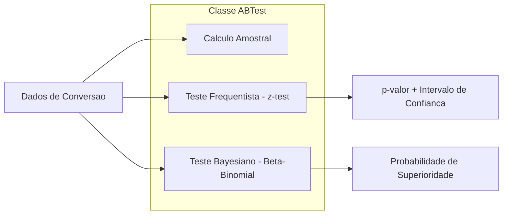
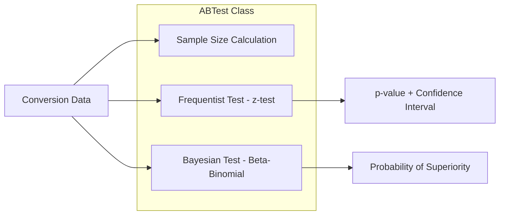

# A/B Testing Statistical Framework

Framework estatistico para testes A/B com abordagens frequentista e bayesiana.

[](https://python.org)
[](https://scipy.org)
[](LICENSE)

[English](#english) | [Portugues](#portugues)

---

## Portugues

### Visao Geral

Biblioteca Python para testes A/B de taxa de conversao, implementando tanto o teste frequentista (z-test de duas proporcoes) quanto o teste bayesiano (priori Beta-Binomial com amostragem Monte Carlo). Inclui calculo de tamanho amostral necessario.

### Arquitetura



### Funcionalidades

- **Calculo de tamanho amostral** — determina visitantes necessarios para significancia estatistica
- **Teste frequentista** — z-test de duas proporcoes com p-valor e intervalo de confianca
- **Teste bayesiano** — priori Beta(1,1) com amostragem Monte Carlo (10.000 simulacoes)
- **Validacao de entrada** — verificacao de parametros antes da execucao
- **Impressao de resultados** — formatacao legivel dos resultados

### Como Executar

```bash
# Instalar dependencias
pip install -r requirements.txt

# Executar demo
python src/hypothesis_testing/ab_test.py

# Executar testes (25 testes)
pytest tests/test_ab_framework.py -v
```

### Exemplo de Uso

```python
from src.hypothesis_testing.ab_test import ABTest

ab = ABTest()

# Calculo de tamanho amostral
sample_size = ab.calculate_sample_size(
    baseline_rate=0.10,
    minimum_detectable_effect=0.02
)

# Teste frequentista
result = ab.run_frequentist_test(
    visitors_a=1000, conversions_a=100,
    visitors_b=1000, conversions_b=130
)

# Teste bayesiano
bayesian = ab.run_bayesian_test(
    visitors_a=1000, conversions_a=100,
    visitors_b=1000, conversions_b=130
)
```

### Estrutura do Projeto

```
ab-testing-statistical-framework-python/
├── src/
│   ├── __init__.py
│   └── hypothesis_testing/
│       ├── __init__.py
│       └── ab_test.py            # Classe ABTest (~300 linhas)
├── tests/
│   ├── __init__.py
│   └── test_ab_framework.py     # 25 testes
├── .gitignore
├── LICENSE
├── README.md
├── requirements.txt
└── setup.py
```

### Tecnologias

| Tecnologia | Uso |
|------------|-----|
| Python | Linguagem principal |
| SciPy | Funcoes estatisticas (norm) |
| NumPy | Computacao numerica (amostragem Beta) |

---

## English

### Overview

Python library for A/B testing of conversion rates, implementing both frequentist (two-proportion z-test) and Bayesian (Beta-Binomial conjugate prior with Monte Carlo sampling) approaches. Includes required sample size calculation.

### Architecture



### Features

- **Sample size calculation** — determines visitors needed for statistical significance
- **Frequentist test** — two-proportion z-test with p-value and confidence interval
- **Bayesian test** — Beta(1,1) prior with Monte Carlo sampling (10,000 simulations)
- **Input validation** — parameter checking before execution
- **Result printing** — readable formatting of results

### How to Run

```bash
# Install dependencies
pip install -r requirements.txt

# Run demo
python src/hypothesis_testing/ab_test.py

# Run tests (25 tests)
pytest tests/test_ab_framework.py -v
```

### Usage Example

```python
from src.hypothesis_testing.ab_test import ABTest

ab = ABTest()

# Sample size calculation
sample_size = ab.calculate_sample_size(
    baseline_rate=0.10,
    minimum_detectable_effect=0.02
)

# Frequentist test
result = ab.run_frequentist_test(
    visitors_a=1000, conversions_a=100,
    visitors_b=1000, conversions_b=130
)

# Bayesian test
bayesian = ab.run_bayesian_test(
    visitors_a=1000, conversions_a=100,
    visitors_b=1000, conversions_b=130
)
```

### Project Structure

```
ab-testing-statistical-framework-python/
├── src/
│   ├── __init__.py
│   └── hypothesis_testing/
│       ├── __init__.py
│       └── ab_test.py            # ABTest class (~300 lines)
├── tests/
│   ├── __init__.py
│   └── test_ab_framework.py     # 25 tests
├── .gitignore
├── LICENSE
├── README.md
├── requirements.txt
└── setup.py
```

### Technologies

| Technology | Usage |
|------------|-------|
| Python | Core language |
| SciPy | Statistical functions (norm) |
| NumPy | Numerical computation (Beta sampling) |

---

**Autor / Author:** Gabriel Demetrios Lafis
- GitHub: [@galafis](https://github.com/galafis)
- LinkedIn: [Gabriel Demetrios Lafis](https://linkedin.com/in/gabriel-demetrios-lafis)
