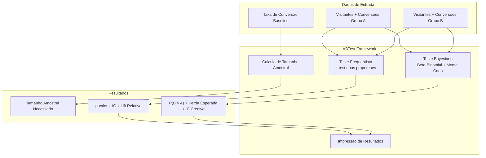
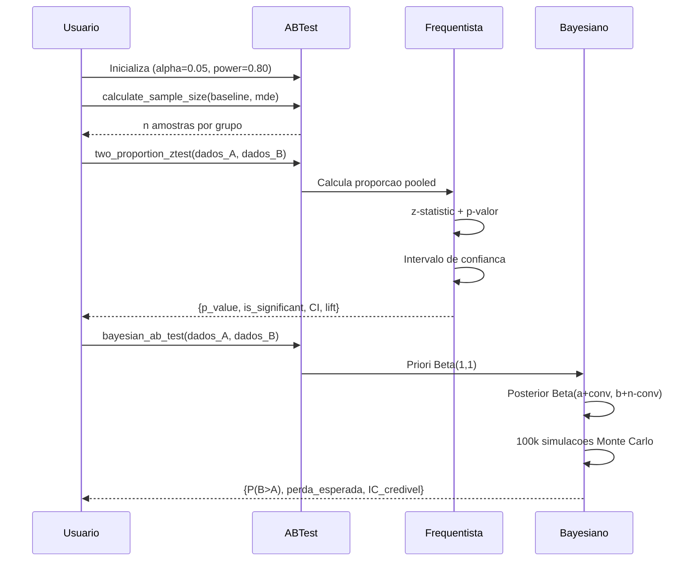
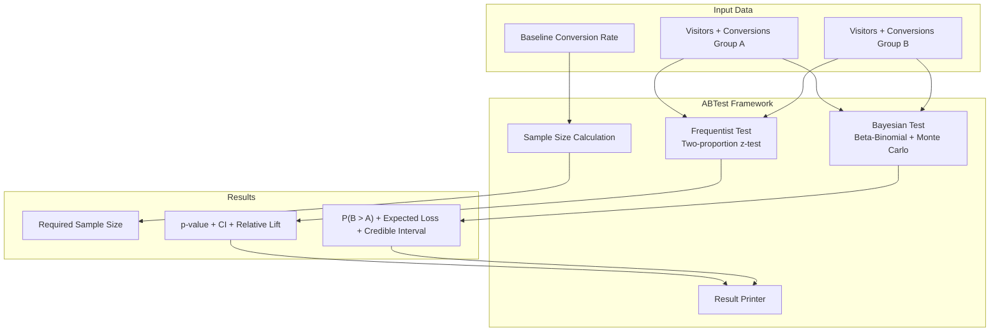
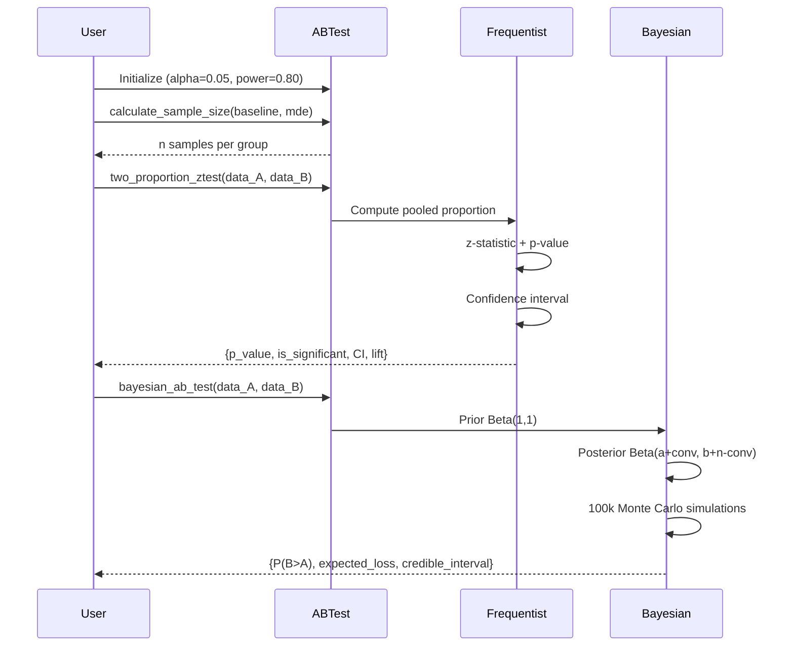

<div align="center">

# A/B Testing Statistical Framework

[](https://python.org)
[](https://scipy.org)
[](https://numpy.org)
[](LICENSE)
[](Dockerfile)
[](tests/)

Framework estatistico completo para testes A/B com abordagens frequentista e bayesiana, incluindo calculo de tamanho amostral, z-test de duas proporcoes e inferencia Beta-Binomial via Monte Carlo.

Complete statistical framework for A/B testing with frequentist and Bayesian approaches, including sample size calculation, two-proportion z-test and Beta-Binomial inference via Monte Carlo.

[Portugues](#portugues) | [English](#english)

</div>

---

## Portugues

### Sobre

Biblioteca Python projetada para equipes de produto, growth e data science que precisam tomar decisoes baseadas em dados sobre variantes de conversao. Combina rigor estatistico com simplicidade de uso, oferecendo tanto a abordagem classica (frequentista com z-test) quanto a abordagem moderna (bayesiana com priori Beta-Binomial e 100.000 simulacoes Monte Carlo). O calculo automatico de tamanho amostral garante que experimentos sejam dimensionados corretamente antes da execucao.

### Tecnologias

| Tecnologia | Versao | Papel |
|---|---|---|
| **Python** | 3.9+ | Linguagem principal |
| **SciPy** | >= 1.11.0 | Distribuicoes estatisticas e z-scores |
| **NumPy** | >= 1.24.0 | Amostragem Beta e computacao vetorizada |
| **pytest** | >= 8.0.0 | Suite de testes (25 testes) |
| **Docker** | - | Containerizacao |

### Arquitetura


```mermaid
graph TD
    subgraph Framework["ABTest Framework"]
        SS["Calculo de Tamanho Amostral"]
        FT["Teste Frequentista<br/>z-test duas proporcoes"]
        BT["Teste Bayesiano<br/>Beta-Binomial + Monte Carlo"]
        PR["Impressao de Resultados"]
    end

    subgraph Entrada["Dados de Entrada"]
        CR["Taxa de Conversao Baseline"]
        VA["Visitantes + Conversoes Grupo A"]
        VB["Visitantes + Conversoes Grupo B"]
    end

    subgraph Saida["Resultados"]
        N["Tamanho Amostral Necessario"]
        PV["p-valor + IC + Lift Relativo"]
        BP["P(B > A) + Perda Esperada + IC Credivel"]
    end

    CR --> SS --> N
    VA --> FT
    VB --> FT
    FT --> PV
    VA --> BT
    VB --> BT
    BT --> BP
    PV --> PR
    BP --> PR
```

### Fluxo de Execucao


```mermaid
sequenceDiagram
    participant U as Usuario
    participant AB as ABTest
    participant F as Frequentista
    participant B as Bayesiano

    U->>AB: Inicializa (alpha=0.05, power=0.80)
    U->>AB: calculate_sample_size(baseline, mde)
    AB-->>U: n amostras por grupo

    U->>AB: two_proportion_ztest(dados_A, dados_B)
    AB->>F: Calcula proporcao pooled
    F->>F: z-statistic + p-valor
    F->>F: Intervalo de confianca
    F-->>U: {p_value, is_significant, CI, lift}

    U->>AB: bayesian_ab_test(dados_A, dados_B)
    AB->>B: Priori Beta(1,1)
    B->>B: Posterior Beta(a+conv, b+n-conv)
    B->>B: 100k simulacoes Monte Carlo
    B-->>U: {P(B>A), perda_esperada, IC_credivel}
```

### Estrutura do Projeto

```
ab-testing-statistical-framework-python/
├── src/
│   ├── __init__.py
│   └── hypothesis_testing/
│       ├── __init__.py
│       └── ab_test.py                    # Classe ABTest (300 LOC)
├── tests/
│   ├── __init__.py
│   └── test_ab_framework.py             # 25 testes unitarios (436 LOC)
├── .gitignore
├── Dockerfile
├── LICENSE                               # MIT
├── README.md
├── requirements.txt
└── setup.py
```

### Inicio Rapido

```bash
# Clonar repositorio
git clone https://github.com/galafis/ab-testing-statistical-framework-python.git
cd ab-testing-statistical-framework-python

# Criar ambiente virtual
python -m venv venv
source venv/bin/activate  # Windows: venv\Scripts\activate

# Instalar dependencias
pip install -r requirements.txt

# Executar demo
python src/hypothesis_testing/ab_test.py
```

### Docker

```bash
docker build -t ab-testing-framework .
docker run --rm ab-testing-framework
```

### Testes

```bash
# Executar todos os 25 testes
pytest tests/test_ab_framework.py -v

# Com cobertura
pytest tests/test_ab_framework.py --cov=src --cov-report=term-missing
```

### Benchmarks

| Operacao | Tempo Medio | Observacao |
|---|---|---|
| Calculo tamanho amostral | < 1 ms | Deterministico |
| z-test (duas proporcoes) | < 1 ms | Analitico |
| Teste bayesiano (100k sim) | ~50 ms | Monte Carlo |
| Suite completa (25 testes) | < 3 s | pytest |

### Exemplo de Uso

```python
from src.hypothesis_testing.ab_test import ABTest

ab = ABTest(alpha=0.05, power=0.80)

# 1. Dimensionar experimento
n = ab.calculate_sample_size(baseline_rate=0.10, mde=0.20)
print(f"Amostras necessarias por grupo: {n}")

# 2. Teste frequentista
freq = ab.two_proportion_ztest(
    conversions_a=120, visitors_a=1500,
    conversions_b=145, visitors_b=1500
)
print(f"p-valor: {freq['p_value']:.4f}")
print(f"Significativo: {freq['is_significant']}")

# 3. Teste bayesiano
bayes = ab.bayesian_ab_test(
    conversions_a=120, visitors_a=1500,
    conversions_b=145, visitors_b=1500
)
print(f"P(B > A): {bayes['prob_b_better_than_a']:.2%}")
```

### Aplicabilidade na Industria

| Setor | Caso de Uso | Metrica |
|---|---|---|
| **E-commerce** | Teste de pagina de checkout | Taxa de conversao |
| **SaaS** | Variantes de pricing page | Taxa de assinatura |
| **Fintech** | Fluxos de onboarding | Ativacao de conta |
| **Marketing Digital** | Landing pages e CTAs | Click-through rate |
| **Produto** | Feature flags e rollouts | Retencao e engajamento |
| **Saude** | Ensaios clinicos simplificados | Taxa de resposta |

### Licenca

Este projeto esta licenciado sob a Licenca MIT - veja o arquivo [LICENSE](LICENSE) para detalhes.

---

## English

### About

Python library designed for product, growth and data science teams that need data-driven decisions about conversion variants. Combines statistical rigor with ease of use, offering both the classical approach (frequentist with z-test) and the modern approach (Bayesian with Beta-Binomial prior and 100,000 Monte Carlo simulations). Automatic sample size calculation ensures experiments are properly sized before execution.

### Technologies

| Technology | Version | Role |
|---|---|---|
| **Python** | 3.9+ | Core language |
| **SciPy** | >= 1.11.0 | Statistical distributions and z-scores |
| **NumPy** | >= 1.24.0 | Beta sampling and vectorized computation |
| **pytest** | >= 8.0.0 | Test suite (25 tests) |
| **Docker** | - | Containerization |

### Architecture


```mermaid
graph TD
    subgraph Framework["ABTest Framework"]
        SS["Sample Size Calculation"]
        FT["Frequentist Test<br/>Two-proportion z-test"]
        BT["Bayesian Test<br/>Beta-Binomial + Monte Carlo"]
        PR["Result Printer"]
    end

    subgraph Input["Input Data"]
        CR["Baseline Conversion Rate"]
        VA["Visitors + Conversions Group A"]
        VB["Visitors + Conversions Group B"]
    end

    subgraph Output["Results"]
        N["Required Sample Size"]
        PV["p-value + CI + Relative Lift"]
        BP["P(B > A) + Expected Loss + Credible Interval"]
    end

    CR --> SS --> N
    VA --> FT
    VB --> FT
    FT --> PV
    VA --> BT
    VB --> BT
    BT --> BP
    PV --> PR
    BP --> PR
```

### Execution Flow


```mermaid
sequenceDiagram
    participant U as User
    participant AB as ABTest
    participant F as Frequentist
    participant B as Bayesian

    U->>AB: Initialize (alpha=0.05, power=0.80)
    U->>AB: calculate_sample_size(baseline, mde)
    AB-->>U: n samples per group

    U->>AB: two_proportion_ztest(data_A, data_B)
    AB->>F: Compute pooled proportion
    F->>F: z-statistic + p-value
    F->>F: Confidence interval
    F-->>U: {p_value, is_significant, CI, lift}

    U->>AB: bayesian_ab_test(data_A, data_B)
    AB->>B: Prior Beta(1,1)
    B->>B: Posterior Beta(a+conv, b+n-conv)
    B->>B: 100k Monte Carlo simulations
    B-->>U: {P(B>A), expected_loss, credible_interval}
```

### Project Structure

```
ab-testing-statistical-framework-python/
├── src/
│   ├── __init__.py
│   └── hypothesis_testing/
│       ├── __init__.py
│       └── ab_test.py                    # ABTest class (300 LOC)
├── tests/
│   ├── __init__.py
│   └── test_ab_framework.py             # 25 unit tests (436 LOC)
├── .gitignore
├── Dockerfile
├── LICENSE                               # MIT
├── README.md
├── requirements.txt
└── setup.py
```

### Quick Start

```bash
# Clone repository
git clone https://github.com/galafis/ab-testing-statistical-framework-python.git
cd ab-testing-statistical-framework-python

# Create virtual environment
python -m venv venv
source venv/bin/activate  # Windows: venv\Scripts\activate

# Install dependencies
pip install -r requirements.txt

# Run demo
python src/hypothesis_testing/ab_test.py
```

### Docker

```bash
docker build -t ab-testing-framework .
docker run --rm ab-testing-framework
```

### Tests

```bash
# Run all 25 tests
pytest tests/test_ab_framework.py -v

# With coverage
pytest tests/test_ab_framework.py --cov=src --cov-report=term-missing
```

### Benchmarks

| Operation | Average Time | Note |
|---|---|---|
| Sample size calculation | < 1 ms | Deterministic |
| z-test (two proportions) | < 1 ms | Analytical |
| Bayesian test (100k sim) | ~50 ms | Monte Carlo |
| Full suite (25 tests) | < 3 s | pytest |

### Usage Example

```python
from src.hypothesis_testing.ab_test import ABTest

ab = ABTest(alpha=0.05, power=0.80)

# 1. Size the experiment
n = ab.calculate_sample_size(baseline_rate=0.10, mde=0.20)
print(f"Required samples per group: {n}")

# 2. Frequentist test
freq = ab.two_proportion_ztest(
    conversions_a=120, visitors_a=1500,
    conversions_b=145, visitors_b=1500
)
print(f"p-value: {freq['p_value']:.4f}")
print(f"Significant: {freq['is_significant']}")

# 3. Bayesian test
bayes = ab.bayesian_ab_test(
    conversions_a=120, visitors_a=1500,
    conversions_b=145, visitors_b=1500
)
print(f"P(B > A): {bayes['prob_b_better_than_a']:.2%}")
```

### Industry Applicability

| Sector | Use Case | Metric |
|---|---|---|
| **E-commerce** | Checkout page testing | Conversion rate |
| **SaaS** | Pricing page variants | Subscription rate |
| **Fintech** | Onboarding flows | Account activation |
| **Digital Marketing** | Landing pages and CTAs | Click-through rate |
| **Product** | Feature flags and rollouts | Retention and engagement |
| **Healthcare** | Simplified clinical trials | Response rate |

### License

This project is licensed under the MIT License - see the [LICENSE](LICENSE) file for details.

---

<div align="center">

**Autor / Author:** Gabriel Demetrios Lafis

[](https://github.com/galafis)
[](https://linkedin.com/in/gabriel-demetrios-lafis)

</div>
